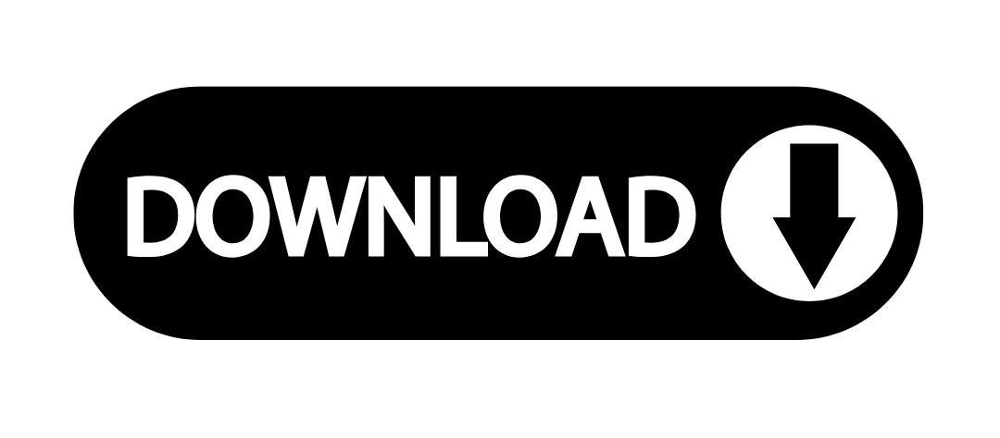

Visit Garmin.com/Express to Download & Use Garmin Express in Minutes
====================================================================

If you own a Garmin GPS device, fitness watch, or any other smart gadget by Garmin, keeping it updated is essential for accurate performance and new features. Thankfully, Garmin makes it incredibly simple with its official software — **Garmin Express**.

Whether you’re new to Garmin or just need a quick refresh, this guide will walk you through how to **download, install, and use Garmin Express in just a few minutes** via `Garmin.com/Express <https://www.garmin.com/express/>`_.

What is Garmin Express?
-----------------------

**Garmin Express** is a free desktop application that helps users manage and update their Garmin devices. From syncing fitness data to installing the latest maps, Garmin Express is your all-in-one tool for maintaining optimal device functionality.

Key Features of Garmin Express:
-------------------------------

- Download & install software updates
- Update road maps for GPS devices
- Sync fitness data to Garmin Connect
- Register new Garmin products
- Back up and restore your device settings

Step-by-Step: Download Garmin Express in Minutes
------------------------------------------------

Follow these quick steps to get started:

1. **Visit the Official Site**  
   Go to `Garmin.com/Express <https://www.garmin.com/express/>`_ in your browser.

2. **Download for Your System**  
   Choose your operating system:
   - Click “Download for Windows” or  
   - “Download for Mac” if you’re on a macOS device.

3. **Install the App**  
   Open the downloaded file and follow on-screen prompts to complete installation. It usually takes under 3 minutes.

4. **Launch Garmin Express**  
   Once installed, open the application from your desktop or start menu.

How to Use Garmin Express to Update Your Device
-----------------------------------------------

1. Connect your Garmin device to your computer via USB cable.  
2. Open Garmin Express and click “Add a Device.”  
3. Once detected, Garmin will prompt you to register the device (if it’s new).  
4. The app will automatically check for updates.  
5. Click “Install All” to apply software or map updates.

It’s that easy—no technical expertise needed!

Real-Life Use Case: Quick Update Before a Marathon
--------------------------------------------------

**Neha**, a regular marathon runner from Delhi, shared her experience:

    "I use a Garmin Forerunner 255 for my training. A few days before the Mumbai Marathon, I realized the pace tracking was slightly off. I visited Garmin.com/Express, downloaded Garmin Express, and updated my device in under 10 minutes. Post-update, the performance was smooth and accurate during the race. It made a real difference in my timing!"

Devices Compatible with Garmin Express
--------------------------------------

- Garmin Drive, DriveSmart, Dezl, Nuvi (Automotive GPS)
- Garmin Forerunner, Vivosmart, Fenix, Instinct (Fitness Watches)
- Garmin Edge (Cycling Computers)
- Garmin Marine & Aviation Units

Why You Should Update Your Garmin Device Regularly
--------------------------------------------------

- Avoid GPS errors and bugs
- Get new map data for accurate navigation
- Enhance battery and software performance
- Access new features & security patches

Final Thoughts
--------------

**Garmin.com/Express** is the official and safest way to keep your Garmin devices updated and running smoothly. In just a few clicks, you can download the tool, connect your device, and enjoy seamless performance — whether you're driving across the country or running your next 10K.

Don’t wait. `Visit Garmin.com/Express <https://www.garmin.com/express/>`_ and update your device today!
